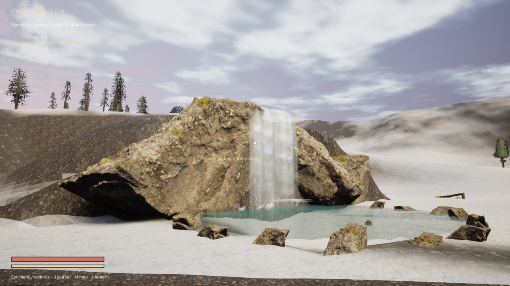
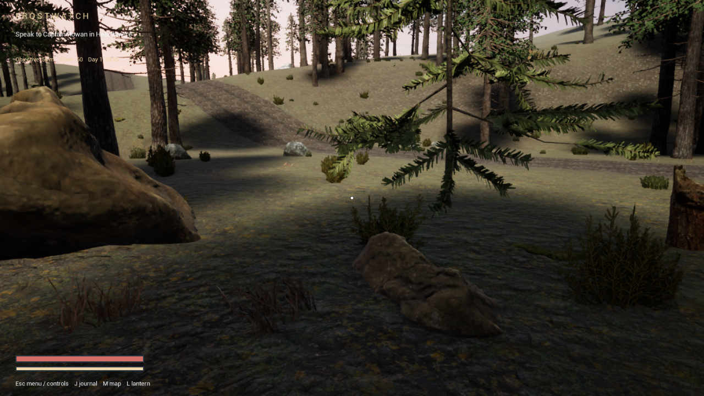
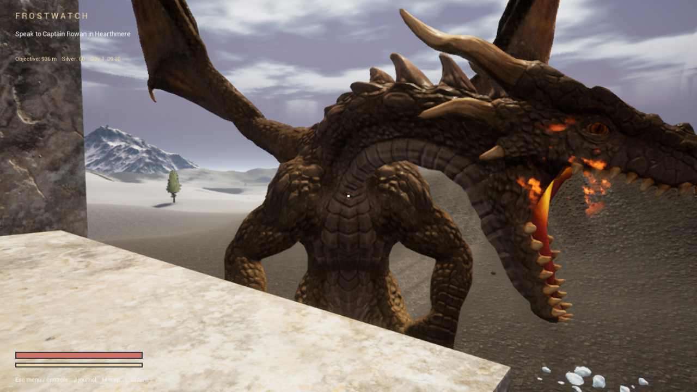

# Performance — preview 0.4

Measured on GTX 1060 3 GB, Core i7-8750H and 32 GB RAM. Fullscreen 1280 x 720, uncapped with VSync off, live NPCs, stationary cameras and controlled weather. Balanced render scale is 85% unless stated otherwise.

| Scene / preset | Mean FPS | p95 frame time |
| --- | ---: | ---: |
| Woodland, earlier Balanced comparison | 41.1 | 27.11 ms |
| Woodland, revised Balanced | 53.7 | 21.43 ms |
| Village, Balanced | 64.6 | 19.12 ms |
| Waterfall, Balanced | 82.3 | 14.06 ms |
| Castle courtyard at night, Balanced | 82.1 | 14.15 ms |
| Castle hall at night, Balanced | 84.5 | 14.59 ms |
| Active dragon encounter, Balanced | 76.6 | 15.32 ms |
| Woodland, Performance | 72.5 | 15.73 ms |
| Woodland, Balanced native 100% | 54.0 | 20.06 ms |

All eight revised configurations passed graphics-memory and render-error checks. The dragon benchmark keeps the diagnostic character invulnerable so the encounter stays active; this does not affect ordinary play. These are controlled measurements, not a minimum FPS guarantee. Other hardware has not been validated.

Balanced retains Lumen lighting and uses cheaper conventional shadows, a 384 MiB texture streaming budget, finer allowed texture mips and reduced foliage wind work beyond 80 metres. High and Epic retain virtual shadows. A 256 MiB asset-read cache and 32 MiB read buffers use system RAM; no isolated FPS gain is attributed to the cache alone.

174 packaged gameplay checks passed. Terrain repetition, angular shorelines and the grove's geometric roots/branches remain visible art limitations. This is a playable preview, not a finished AAA release.

