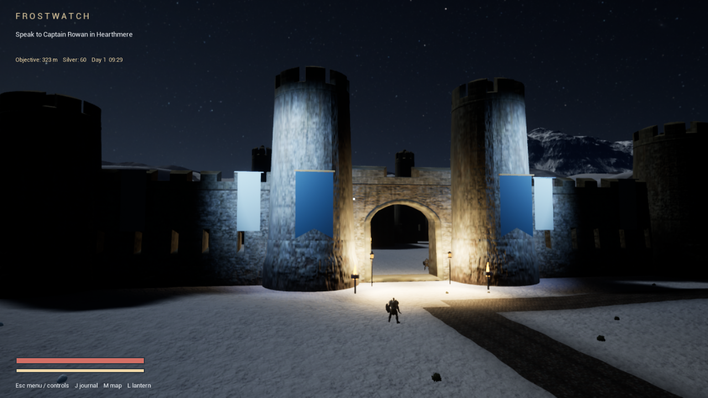
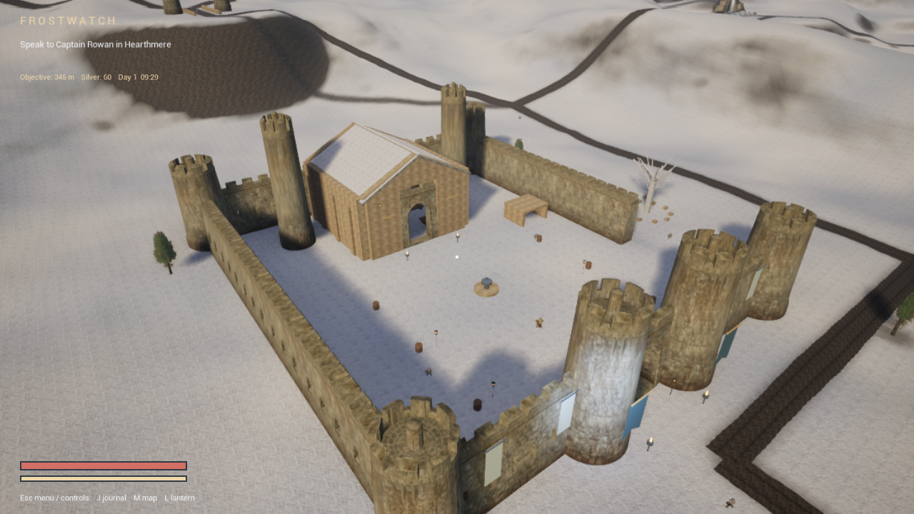

# Performance — preview 0.5.2

## New moving and combat checks

The packaged build passed 78 combat/contact/pose checks, 71 campaign checks and 50 runtime checks (199 total). Its live parry/counter encounter passed with 2 parries and the enemy defeated. These checks remain distinct from a human playthrough.

A controlled movement capture through woodland and the northern road toward the castle on the same Omen used Balanced, 1280×720, 85% render scale, live NPC simulation, no frame cap and benchmark invulnerability. The player was 273.6 metres from the scripted starting point when graphics were sampled. The complete measured interval below discards the first eight seconds of frame tracking; it is longer than the previous final-600-frame samples but does not cover the whole campaign or mounted travel. The walk log continues briefly after the graphics snapshot, so its final distance is not used as the measured endpoint here.

| Moving capture measurement | Result |
| --- | ---: |
| Measured duration | 91.5 seconds |
| Mean FPS | 69.8 |
| p95 frame time | 19.19 ms |
| p99 frame time | 23.01 ms |
| Worst frame | 74.87 ms |
| Frames over 50 ms | 3 |
| Frames over 100 ms | 0 |

This is measurement coverage, not a claimed performance improvement. No matching old-build moving-session baseline was recorded. Review slow frames separately from average FPS. Larger-text/reduced-motion UI captures were also checked at 960×540; those are layout checks, not gameplay benchmarks.

## Historical 0.5.1 castle and night-path samples

The following measurements remain explicitly historical; they have not been relabelled as a new 0.5.2 benchmark.

Measured on GTX 1060 3 GB, Core i7-8750H and 32 GB RAM. These historical captures use Balanced, 1280 × 720 output, 85% render scale, no frame cap and VSync off. Cameras are stationary, NPC simulation is frozen, weather is controlled, and each sample reports the final 600 frames. These are rendering regression checks, not moving-gameplay or minimum-FPS guarantees.

| Scene | Mean FPS | p95 frame time |
| --- | ---: | ---: |
| Castle approach | 87.5 | 13.38 ms |
| Castle gate | 85.4 | 13.82 ms |
| Castle courtyard | 79.0 | 15.69 ms |
| Castle great hall | 77.1 | 15.52 ms |
| Woodland night path, lantern off | 40.9 | 30.62 ms |
| Woodland night path, lantern on | 40.3 | 30.45 ms |
| Close-character lantern check | 37.5 | 30.48 ms |

The previous local courtyard sample was 91.0 FPS and the hall was 105.3 FPS under matching conditions. The richer castle costs performance. The woodland remains below 60 FPS and needs further work. Lantern on/off samples do not establish a performance gain from the lighting change. All listed checks passed graphics-memory acceptance; the accepted captures reported no render errors.

Balanced retains Lumen lighting and uses conventional shadows, a 384 MiB texture streaming budget, finer permitted texture mips and reduced distant foliage wind work. High and Epic retain virtual shadows. A 256 MiB asset-read cache and 32 MiB read buffers use system RAM; no isolated FPS gain is attributed to caching.

193 packaged gameplay checks passed: 72 combat/contact, 71 campaign and 50 runtime. The installed build then repeated the 71 campaign and 50 runtime checks successfully. These assertions do not replace a full fresh-save playthrough, sustained travel/combat profiling or testing on other hardware. Book/parchment layouts were checked at 960×540, 1280×720 and 1920×1080; these UI checks are not gameplay performance benchmarks.

Architecture, terrain/road repetition, shoreline transitions, abrupt enemy animation changes and sustained performance remain open work. This is a development preview, not a finished AAA release. The older 0.4 measurements in repository history used different live-world conditions and must not be presented as current 0.5.1 results.

## 0.5.3 scope

The first combat review recorded 9.293 MiB of transient GPU-memory demotion and failed resource acceptance. Reducing temporary texture replacement memory from 32 to 16 MiB passed the same review with no demotion under a nearly identical roughly 2,009 MiB GPU budget. The texture pool and quality settings are unchanged. The smaller batch is now the Performance/Balanced default. The 24 screenshot captures in the combat review create blocking stalls and are not a gameplay FPS benchmark.

A final moving-route test on the Omen i7-8750H / GTX 1060 3 GB / 32 GB RAM used Balanced, 1280 × 720, 85% render scale, uncapped, live NPCs, controlled daylight and scripted benchmark-invulnerable movement. After eight seconds of warmup it recorded 91.4 seconds and approximately 274 metres to the graphics snapshot. Mean 67.7 FPS; p95 19.40 ms; p99 22.66 ms; worst 95.46 ms; 1 frames above 50 ms and 0 above 100 ms. Peak recorded demotion was zero. This is one route, not an entire-game or thermal-endurance guarantee, and not a controlled claim of improved FPS against a previous release.

Save writes now include backup and readback I/O. Capture mode disables normal autosaving, so this moving test does not measure save latency. Packaged storage regression tests separately exercised real diagnostic-slot I/O and simulated failures. Older figures above remain dated 0.5.2/0.5.1 measurements.

## 0.5.4 regression scope

This update reuses two scenery actors and one existing NPC. Balanced reduces the Lumen surface-lighting cache from 1280 to 1152 pixels per side. Lumen remains enabled and the 384 MiB material texture pool is retained. Performance/Balanced temporary streaming batches are reduced from 16 to 8 MiB; High/Epic settings are retained. On the Omen, the same scripted moving route used Balanced, 1280 × 720, 85% render scale, uncapped, live NPCs and controlled daylight, with deliveries completed and Edrin returned. After eight seconds of warmup: 91.5 seconds, mean 73.0 FPS, p95 19.09 ms, p99 21.86 ms, worst 80.58 ms, 2 frames over 50 ms and 0 over 100 ms. Peak recorded GPU-memory demotion was zero. This is a route regression check, not a whole-game or thermal-endurance guarantee. Diagnostic capture mode disables normal autosaving.

The live combat benchmark retained 24 gameplay samples but disabled the 24 mid-fight PNG exports; it still captured a final image. Two parries and an enemy defeat passed with player health 100. Its post-warmup interval recorded mean 56.9 FPS with the 60 FPS cap, p95 20.01 ms and worst 35.63 ms, with no frames above 50 ms. Peak recorded GPU-memory demotion in this final run was 0.00 MiB. Initial failing memory captures are documented in WORLD-CONSEQUENCES.md. Supply actors now preserve static rendering instead of unnecessarily rebuilding both as movable objects at startup.
