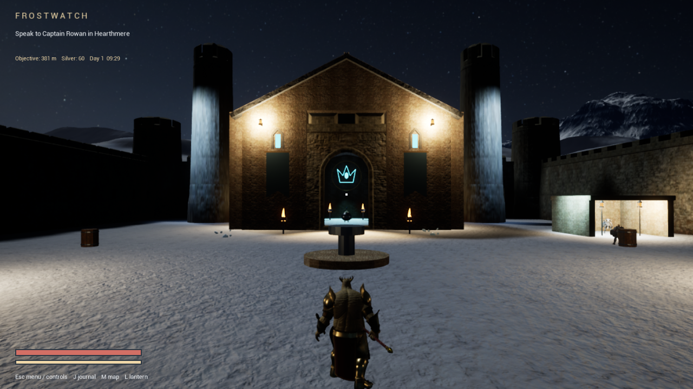
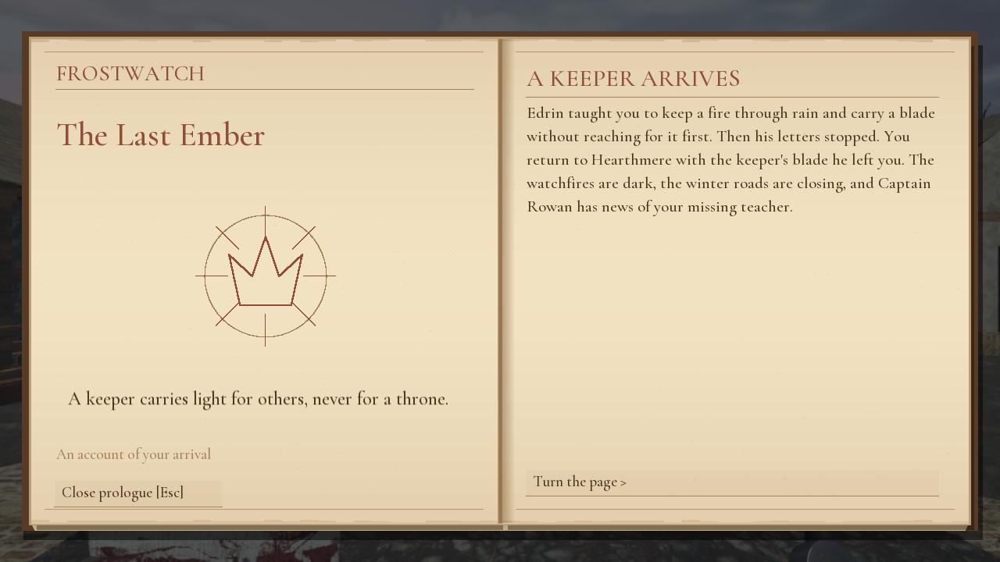
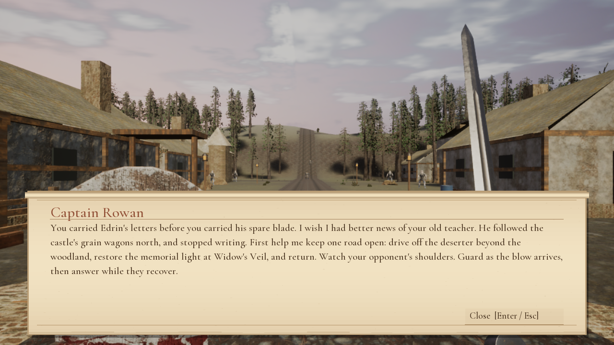
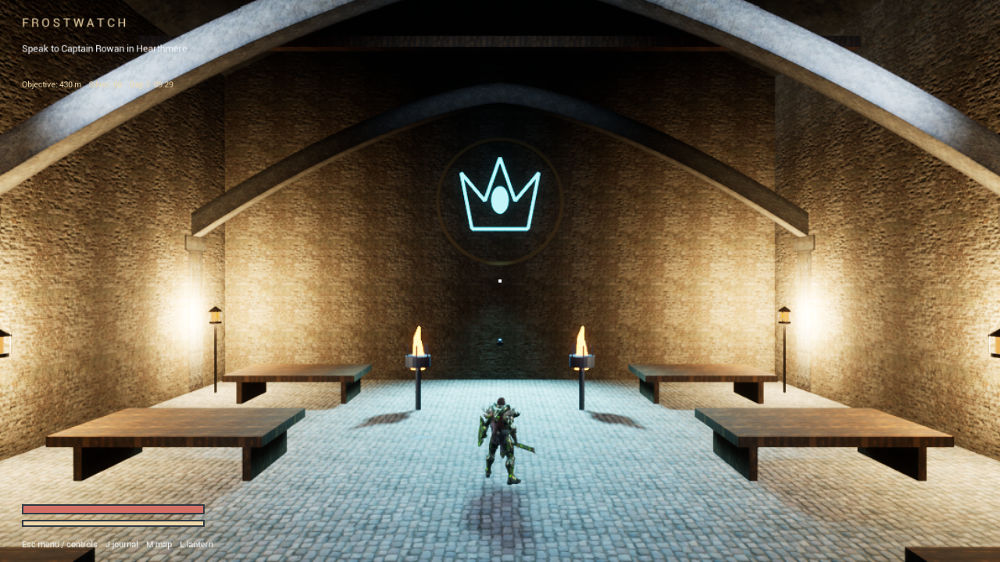

# Frostwatch — The Last Ember

A free, single-player fantasy adventure for Windows, built in Unreal Engine. Explore a winter vale, recover three broken oaths, free Edrin and confront the rulers of Frostwatch.

**[Download the Windows preview](https://github.com/JonBoyd2401/Frostwatch/releases/tag/v0.5.1-preview)**

This is a playable development preview. Performance and animation polish are still being improved; it is not a finished commercial release.

## New in 0.5.1

- A connected Last Ember story linking Edrin, Rowan, the three oaths and the rulers of Frostwatch, with progress-aware dialogue and an aftermath.
- Animated parchment books for the opening, found texts and journal; NPC dialogue slides up on parchment with spoken lines.
- Castle vault ribs, stone paving, standards, a Crown ward and focused night lighting.
- A lantern that illuminates the path, with reduced close-range glare.
- 193 packaged gameplay checks passed. See [measured performance and remaining limitations](PERFORMANCE.md). The richer castle adds rendering cost; woodland performance still needs work.

The library waterfall, animated dragons, regional climates, ordinary-enemy respawns and bounded asset caching from 0.4 remain included.

## Install and play

Development documentation: [technical notes](TECHNICAL-NOTES.md) and [AI-led development, models, token burn and processing time](AI-DEVELOPMENT.md). The human directed and challenged the project through many iterations; AI performed most implementation. Original asset creators receive their own credits.

1. Open the release above and download **Frostwatch-Windows-v0.5.1-preview.zip**. GitHub's automatic “Source code” downloads do not contain the game.
2. Extract the complete ZIP into a writable folder. Keep its Engine and Frostwatch folders alongside the launcher.
3. Run **Play-Frostwatch.cmd**. You do not need Unreal Editor, an Epic account or a game account.
4. Choose **New game**. The opening explains your first objective and directs you to Captain Rowan.

If Windows reports a missing Visual C++ runtime, run the included **Prerequisites/vc_redist.x64.exe**, then launch again. This preview is unsigned; use the download from this repository and the release's SHA-256 checksums to verify the file.

## Controls

| Action | Default control |
| --- | --- |
| Move / look | WASD / mouse |
| Light attack | Left mouse button |
| Heavy attack | R |
| Block / timed parry | Right mouse button |
| Interact / mount / dismount | E |
| Sprint / gallop | Left Shift |
| Jump | Space |
| Journal / quests | J |
| World map | M |
| Pause / settings | Escape |

The in-game controls screen shows the full bindings and supports rebinding. Buffer the next attack during a swing to chain cuts. Hold block during the latter part of a swing to raise your guard as recovery begins. Heavy killing blows, ripostes and stealth executions can sever heads or arms.

## World and campaign

- Ten journal chapters, settlements, caves, castles and discoverable travel camps.
- Townspeople follow daily routes; inns offer food, rooms and stories for in-game silver.
- Horses and carts for travel, with saddle horses able to gallop.
- Weather, a day/night cycle, fountains and waterfalls.
- Recorded weapon sounds and character-specific synthetic dialogue.

## Performance and saves

First launch uses a 1280 × 720 window, Balanced quality, 85% render resolution and a 60 FPS ceiling. Fullscreen, resolution and quality can be changed in Settings. Performance mode is available for lower-powered GPUs. Demanding woodland areas remain below 60 FPS on the development laptop. The initial shader/asset load can take longer on a hard disk.

Windows 64-bit and a DirectX 12-capable GPU with Shader Model 6 support are required by this build. Compatibility outside the development laptop has not yet been established. No Mac, Linux, mobile or browser build is included.

Saves are stored locally in **Frostwatch/Saved/SaveGames**. Back up the complete **Frostwatch/Saved** folder before replacing a build; copy it into the matching location in the extracted update to keep progress and settings. Downloads contain no existing player progress. Gameplay is offline and has no real-money purchases.

## Content and feedback

Contains fantasy violence, blood and dismemberment. Dialogue uses locally generated neural speech, not hired voice actors. Some character rigs and animations are reused across NPCs. Finishing effects use prebuilt head/arm pieces; arbitrary slicing and cinematic execution sequences are not implemented.

Report bugs through [Issues](https://github.com/JonBoyd2401/Frostwatch/issues), including the location, steps to reproduce, graphics preset and GPU model. Please remove personal information before attaching logs.

See the [full creator credits](CREDITS.md), [distribution notes](DISTRIBUTION.md) and [game license](GAME-LICENSE.md). These documents accompany the Windows download. This repository hosts the public download information; it does not distribute Unreal Engine source or the source files for licensed Fab artwork.

