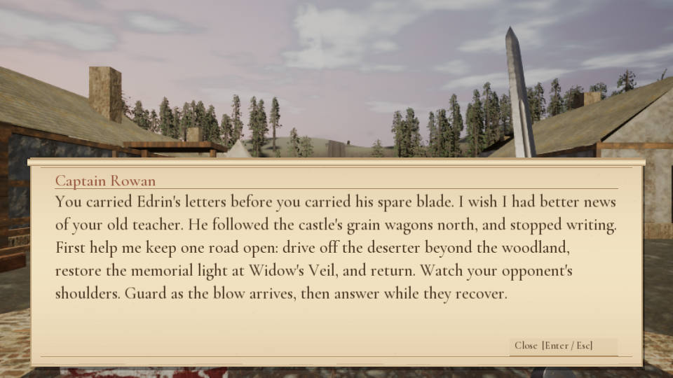
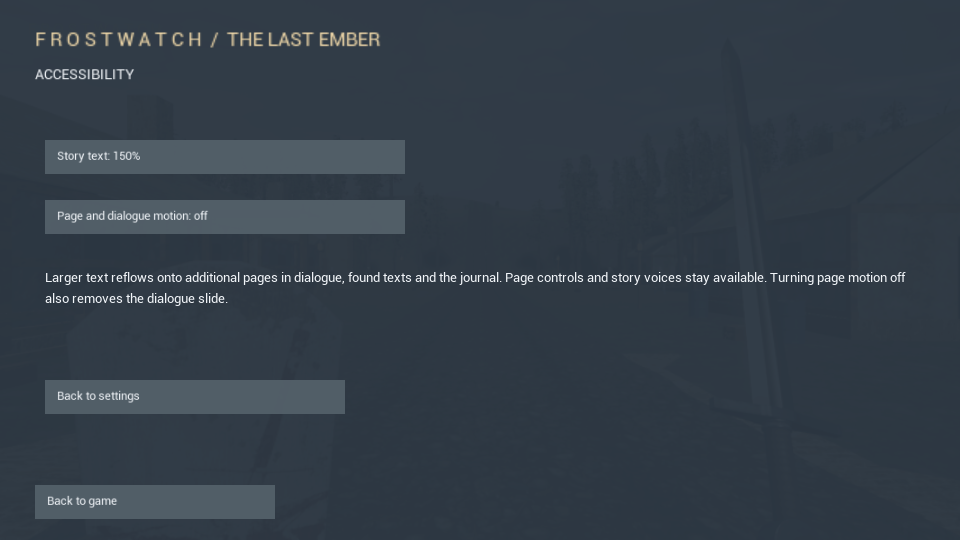

# Frostwatch — The Last Ember

A free, single-player fantasy adventure for Windows, built in Unreal Engine. Explore a winter vale, recover three broken oaths, free Edrin and confront the rulers of Frostwatch.

**[Download the Windows preview](https://github.com/JonBoyd2401/Frostwatch/releases/tag/v0.5.6-preview)**

This is a playable development preview. Performance and animation polish are still being improved; it is not a finished commercial release.

## New in 0.5.6

- Softer road edges, wider worn-ground shoulders and mixed texture scales across the existing road network.
- Clustered winter grass, shrubs and grounded stones around the castle approach, using existing library scenery.
- 252 packaged regression checks, inspected before/after and night views, and a measured moving-route memory/performance check.

See [scope and verification](WORLD-VERGES.md), [castle before](Screenshots/world-castle-before.png) / [after](Screenshots/world-castle-after.png), and [road before](Screenshots/world-road-before.png) / [after](Screenshots/world-road-after.png).

## Previously added in 0.5.5

- A barred prison entrance with a gate that opens after defeating Ste Chlomaine, including compatible behaviour for existing saves.
- A gatehouse gallery, arrow slits and parapet detail above the main entrance; storage bays along the courtyard edge.
- Castle exterior accents now follow daylight, and prison lighting is reduced to avoid the previous washed-out walls.
- 252 packaged checks passed, plus a live combat regression and inspected day/night captures. No new lights or purchased assets.

See [verification and remaining scope](CASTLE-STRUCTURE.md), [the prison](Screenshots/prison-entrance.png), [the gatehouse](Screenshots/gatehouse-approach.png) and [the aerial view](Screenshots/castle-structure-aerial.png).

## Previously added in 0.5.4

- Recovered supply crates disappear from their collection sites. After Captain Rowan accepts the deliveries, both crates appear in Hearthmere and explain their new purpose when inspected.
- Rescued Edrin returns to Hearthmere after the player leaves the prison area. He follows a daytime work routine and an evening inn route using the existing character and animations.
- Existing save flags reconstruct these changes; a fresh expedition restores the original prisoner and supply locations. Rescued Edrin remains available for conversation even when an older save lacks the jailer defeat record.
- Balanced has more GPU-memory headroom through a smaller Lumen lighting cache and smaller temporary streaming batches, retaining Lumen and the existing material texture budget.
- 245 packaged checks passed. A live capture also verified Edrin moving after his return. Automated tests do not replace a full ordinary-play campaign or an external player test.

See the [world-consequence verification notes](WORLD-CONSEQUENCES.md), [village before delivery](Screenshots/supplies-before-delivery.png), [delivered supplies](Screenshots/supplies-after-delivery.png) [returned Edrin](Screenshots/edrin-returned.png) and [Edrin at the inn](Screenshots/edrin-at-the-inn.png).

## Previously added in 0.5.3

- Verified save writes and a previous-generation recovery copy. Continue can recover a missing or unreadable primary save and explains when recent progress may be missing.
- Failed saves no longer claim success. Save-and-quit offers retry or an explicit quit without saving; automatic save failures show a persistent warning. New game and legacy import require a verified backup before replacing a readable existing expedition.
- Compact combat cues for hits, parries, blocks and guard breaks leave the action visible and keep quest guidance intact.
- Pause/title action spacing now fits the complete menu at 960 × 540.
- Performance/Balanced use smaller temporary texture-streaming batches for additional GPU-memory headroom, without reducing the texture pool or texture quality settings.
- 225 packaged checks passed, including simulated storage failures and existing combat/campaign coverage, plus a scripted live parry/counter encounter. Full human playthrough and broader release acceptance remain outstanding.

## Previously added in 0.5.2

- Short humanoid animation transitions soften changes between movement, attacks and reactions while preserving the incoming animation clock and combat timing.
- Settings → Reading and motion offers 100%, 125% or 150% story-body text and an option to disable book/page and dialogue-slide animation. Larger body text wraps onto additional pages.
- Performance diagnostics now retain the complete post-warmup capture, including p99, worst frames and stall counts, rather than only the final camera interval.
- 199 packaged gameplay checks passed, plus a scripted live parry/counter encounter and a sustained woodland-to-castle-approach capture. This does not establish whole-game release readiness.

See the [remaining release programme](ROADMAP.md) and [player-test brief](PLAYER-TEST-BRIEF.md).

## Previously added in 0.5.1

- A connected Last Ember story linking Edrin, Rowan, the three oaths and the rulers of Frostwatch, with progress-aware dialogue and an aftermath.
- Animated parchment books for the opening, found texts and journal; NPC dialogue slides up on parchment with spoken lines.
- Castle vault ribs, stone paving, standards, a Crown ward and focused night lighting.
- A lantern that illuminates the path, with reduced close-range glare.
- 193 packaged gameplay checks passed. See [measured performance and remaining limitations](PERFORMANCE.md). The richer castle adds rendering cost; woodland performance still needs work.

The library waterfall, animated dragons, regional climates, ordinary-enemy respawns and bounded asset caching from 0.4 remain included.

## Install and play

Development documentation: [technical notes](TECHNICAL-NOTES.md) and [AI-led development, models, token burn and processing time](AI-DEVELOPMENT.md). The human directed and challenged the project through many iterations; AI performed most implementation. Original asset creators receive their own credits.

1. Open the release above and download **Frostwatch-Windows-v0.5.6-preview.zip**. GitHub's automatic “Source code” downloads do not contain the game.
2. Extract the complete ZIP into a writable folder. Keep its Engine and Frostwatch folders alongside the launcher.
3. Run **Play-Frostwatch.cmd**. You do not need Unreal Editor, an Epic account or a game account.
4. Choose **New game**. The opening explains your first objective and directs you to Captain Rowan.

If Windows reports a missing Visual C++ runtime, run the included **Prerequisites/vc_redist.x64.exe**, then launch again. This preview is unsigned; use the download from this repository and the release's SHA-256 checksums to verify the file.

## Minimum and recommended PC specifications

These are **provisional requirements for preview 0.5.6**, not certified compatibility or frame-rate guarantees. Only the development laptop has been tested: Windows 11, Core i7-8750H, GeForce GTX 1060 3 GB and 32 GB RAM. The 16 GB minimum and recommended configuration below are engineering estimates pending wider testing.

| Component | Minimum — provisional | Recommended — provisional |
| --- | --- | --- |
| Operating system | Windows 11, 64-bit | Windows 11, 64-bit |
| Processor | Intel Core i7-8750H-class CPU or better | Intel Core i5-12400 / AMD Ryzen 5 5600-class CPU or better |
| System memory | 16 GB RAM; not yet tested at this capacity | 32 GB RAM |
| Graphics card | NVIDIA GeForce GTX 1060 with 3 GB dedicated VRAM or better | NVIDIA GeForce RTX 3060 with 12 GB dedicated VRAM, or comparable GPU with at least 8 GB VRAM |
| Graphics support | DirectX 12 and Shader Model 6 support, with a compatible up-to-date driver | DirectX 12 and Shader Model 6 support, with a compatible up-to-date driver |
| Free storage | 8 GB for download, extraction and working space; HDD supported on the tested laptop | 10 GB free on an SSD for faster loading and asset streaming |
| Suggested starting settings | 1280 × 720, Performance preset; lower render scale if needed | 1920 × 1080, Balanced preset with adjustable render scale; unbenchmarked target |
| Input / audio | Keyboard and mouse; speakers or headphones | Keyboard and mouse; headphones recommended |

The current download is approximately **2.08 GB**, and the extracted files occupy approximately **2.37 GB** before saves, logs and caches. Unreal Editor is not required. The Visual C++ runtime installer is included; internet access is needed to download the game, but gameplay is offline.

In the preceding 0.5.1 build, controlled 720p Balanced captures averaged about **77–79 FPS in the castle hall/courtyard** and **37–41 FPS in the woodland night/close-character checks**. These stationary captures freeze NPC simulation; they do not establish a minimum frame rate during travel or combat. Recommended hardware has not been benchmarked, and 1080p/60 FPS is not yet guaranteed. See [performance measurements and limitations](PERFORMANCE.md).

These specifications are for playing Frostwatch, not running the Unreal Editor. Epic's [rendering feature requirements](https://dev.epicgames.com/documentation/unreal-engine/hardware-and-software-specifications-for-unreal-engine) explain the underlying DirectX/Shader Model requirements; they do not certify this game's performance.

## Controls

| Action | Default control |
| --- | --- |
| Move / look | WASD / mouse |
| Light attack | Left mouse button |
| Heavy attack | R |
| Block / timed parry | Right mouse button |
| Interact / mount / dismount | E |
| Sprint / gallop | Left Shift |
| Jump | Space |
| Journal / quests | J |
| World map | M |
| Pause / settings | Escape |

The in-game controls screen shows the full bindings and supports rebinding. Buffer the next attack during a swing to chain cuts. Hold block during the latter part of a swing to raise your guard as recovery begins. Heavy killing blows, ripostes and stealth executions can sever heads or arms.

## World and campaign

- Ten journal chapters, settlements, caves, castles and discoverable travel camps.
- Townspeople follow daily routes; inns offer food, rooms and stories for in-game silver.
- Horses and carts for travel, with saddle horses able to gallop.
- Weather, a day/night cycle, fountains and waterfalls.
- Recorded weapon sounds and character-specific synthetic dialogue.

## Performance and saves

First launch uses a 1280 × 720 window, Balanced quality, 85% render resolution and a 60 FPS ceiling. Fullscreen, resolution and quality can be changed in Settings. Performance mode is available for lower-powered GPUs. Demanding woodland areas remain below 60 FPS on the development laptop. The initial shader/asset load can take longer on a hard disk.

Windows 64-bit and a DirectX 12-capable GPU with Shader Model 6 support are required by this build. Compatibility outside the development laptop has not yet been established. No Mac, Linux, mobile or browser build is included.

Saves are stored locally in **Frostwatch/Saved/SaveGames**. Back up the complete **Frostwatch/Saved** folder before replacing a build; copy it into the matching location in the extracted update to keep progress and settings. Downloads contain no existing player progress. Gameplay is offline and has no real-money purchases.

## Content and feedback

Contains fantasy violence, blood and dismemberment. Dialogue uses locally generated neural speech, not hired voice actors. Some character rigs and animations are reused across NPCs. Finishing effects use prebuilt head/arm pieces; arbitrary slicing and cinematic execution sequences are not implemented.

Report bugs through [Issues](https://github.com/JonBoyd2401/Frostwatch/issues), including the location, steps to reproduce, graphics preset and GPU model. Please remove personal information before attaching logs.

See the [full creator credits](CREDITS.md), [distribution notes](DISTRIBUTION.md) and [game license](GAME-LICENSE.md). These documents accompany the Windows download. This repository hosts the public download information; it does not distribute Unreal Engine source or the source files for licensed Fab artwork.

